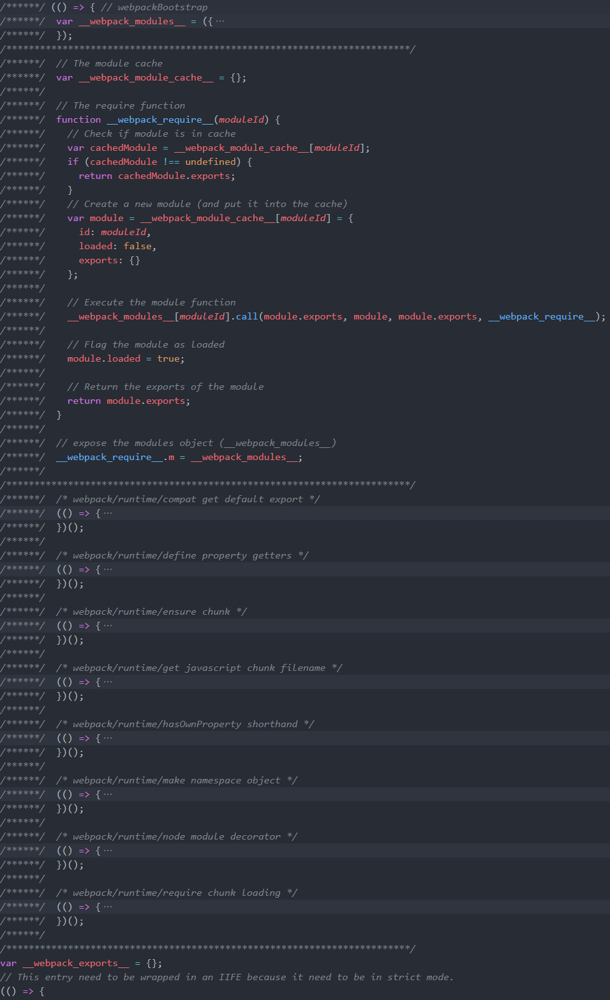
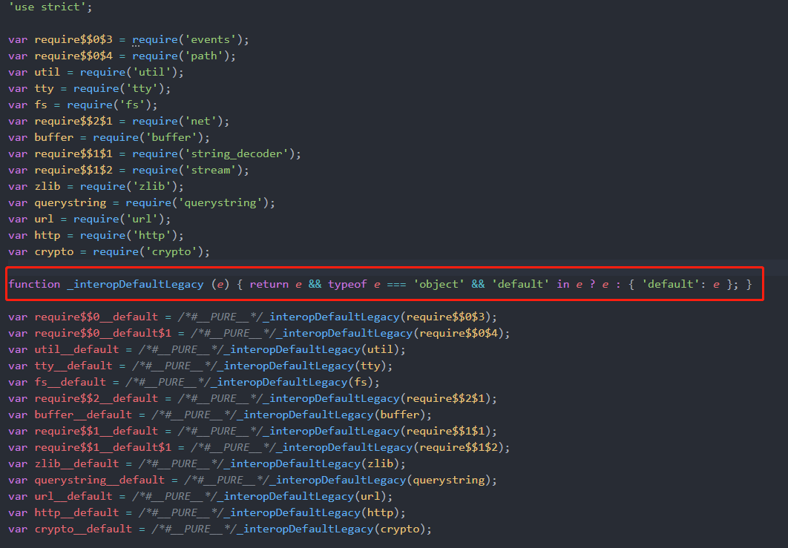
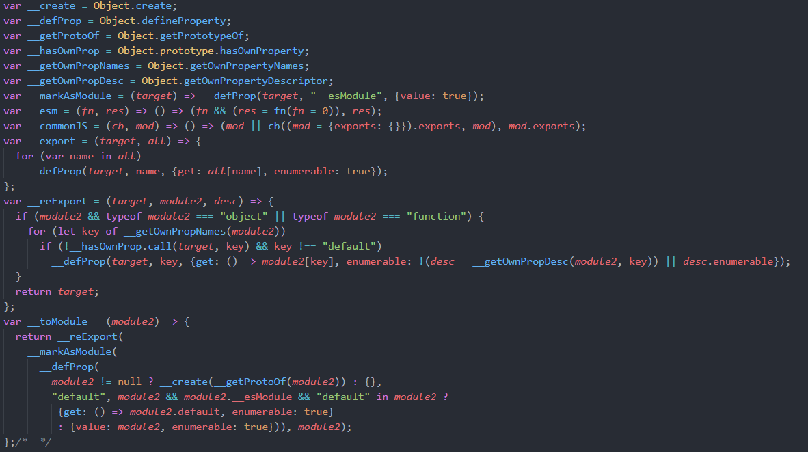

# hello-node-bundler

## Hello! Bundling for node , webpack , rollup and esbuild

<!-- [源码地址](https://github.com/sonofmagic/hello-node-bundler) -->

## 序言

> 古有孔子曰： 茴香豆 的 **茴** 字有**四**种写法

本文主旨并不在于使用大量不同的打包工具，比较这玩意嘛，不在于多，而在于哪个可以使用更少的成本来达到我们的目的

本文代码运行环境如下

- nodejs 14.x (LTS)
- [webpack](https://www.npmjs.com/package/webpack) 5.x
- [rollup](https://www.npmjs.com/package/rollup) 2.x
- [esbuild](https://www.npmjs.com/package/esbuild) 0.11.x

打包的项目示例以 `express` 和 `koa` 为主

## 正文

先说一下，本篇文章打包的都是 `nodejs` 项目，不是前端页面

前端页面打包成 dist 部署，很好理解, spa csr 嘛

而 ssr 的 **多入口打包** 和 **服务端渲染客户端激活** 也容易理解

那么为啥要打包 nodejs 项目呢？ 有必要吗 ？ 这取决与我们自身遇到的场景

### 场景

让我们从 nodejs 的部署开始讲起

先来一张非常有名的图


相信无论是前端还是 nodejs 开发人员，看到这张图都会 会心一笑

什么造成了这种原因? 

原因在于强大又门槛低的 `npm`:

- npm 包自身依赖可以层层依赖,深度非常高
- npm 包作者不按照规范，发布时传了很多垃圾进去 , 现有的 prune 算法也无法做有效的清理
- 更不用说 `.bin/binary` , 还有一些包在安装完成的 npm hook 里去下载大文件了(说的就是你 `puppeteer` )

这些都间接造成了 `node_modules` 又大又深,即使后来 npm 更新了，做了一个 flat 的结构，然而点开后，还是要滚很久（笑~）

我们平常部署nodejs项目：
- 纯 cjs runtime , 直接在线上环境拉代码，`yarn --production` , 然后直接 `node` (docker同理)
- ts nodejs , 本地调试 `ts-node` , 线上需要 `yarn` 把 `devDependencies` 和 `dependencies` 都要安装进来，才可以 `tsc`

那么，我们干脆用前端的思路去进阶一下:

最基础的，就是使用 `webpack/gulp` 这类的去对 `ts nodejs` 做一层代码转化，同时整理相对应的资源

然而，这种添加的 `fake compile time` 大部分，还是以自己的项目为主，很少有会去打包 `node_modules` 的

这当然有考量，毕竟 `node_modules` 里的东西不可控， 除了 `js` ,里面还有很多其他语言的玩意和二进制文件

前端还好，除了 `wasm` , 其他基本都是 js, nodejs 包就丰富多了，`cpp`,`py`,`rs`,`go` 等等，简直就是个动物园，一旦破坏了目录结构，代码在 子进程 , 文件流 等等的路径没有转化，对应文件没有处理，就很容易产生意料不到的错误。

不过在部分 `node_modules` 可控的场景下，还是有必要对其进行打包

### Serverless 场景

通常我们部署使用的是 `layer` + `cloud function` 的方式

通常，我们把 `node_modules` 打成 layer

自个的业务代码做成 `cloud function` , 并做一个关联绑定

在这样的场景下，就让我们的打包工具出厂，来帮助我们解决除开 `builtin-modules` 的第三方依赖了

### Webpack

先上一个 webpack tree shaking 的[文档](https://webpack.js.org/guides/tree-shaking/#root)

#### Webpack Tree shaking info

> Tree shaking is a term commonly used in the JavaScript context for dead-code elimination. It relies on the static structure of ES2015 module syntax, i.e. import and export. The name and concept have been popularized by the ES2015 module bundler rollup.

关键句 It relies on the static structure of ES2015 module syntax

这意味着 webpack 5.x 不对 cjs 模块做 tree shaking 了

[简单的配置项在此](https://github.com/sonofmagic/hello-node-bundler/blob/main/scripts/webpack.config.js)

webpack 默认 nodejs inject:  


大体上和前端方面类似 (调试方面，我都开了`source-map`, 可以直接在 vscode 编译前的源码里加断点)


### Rollup

Rollup 里提到了一句

> Even though this algorithm is not restricted to ES modules, they make it much more efficient as they allow Rollup to treat all modules together as a big abstract syntax tree with shared bindings.

然而在 [tree-shaking issues](https://github.com/rollup/rollup/issues?q=label%3A%22b%C2%B3+%F0%9F%8C%B3+tree-shaking%22+) 里，我也没有找到 针对 cjs 比较好的 `tree-shaking` 方案

rollup 默认 nodejs inject:  


从图上可见，大家都有 `default` 会比较开心

原因自然也是因为 `rollup` 主要的设计就是给 `esm` 用的

不过我自个在对应的配置项，比较喜欢 cjs 来写，而不是官网示例的 esm

这样可以方便使用 nodejs api 直接调试

[配置项在此](https://github.com/sonofmagic/hello-node-bundler/blob/main/scripts/rollup.config.js)

### esbuild

之前在 `umi` 和 `vite` 已经体验过这位 `go` 大神了

esbuild 默认 nodejs inject:  


[配置项在此](https://github.com/sonofmagic/hello-node-bundler/blob/main/scripts/esbuild.config.js)

从图上看也是很有意思的：
```js
var __esm = (fn, res) =>{
  return () => {
    return (fn && (res = fn(fn = 0)), res);
  } 
}
var __commonJS = (cb, mod) =>{
  return () => {
    return (mod || cb((mod = {exports: {}}).exports, mod), mod.exports);
  } 
} 
```
从生成出来的代码来看, 通过这两个方法对引入的模块，进行标记加闭包处理

- esm => init_[module-name]
- cjs => require_[module-name]

而产生的新的函数，则是真正的导入方法

同时，在代码中，假如使用 ES6 的方式导入的话，还会对模块做一次 `__toModule` 的处理
```js
var __toModule = (module2) => {
  return __reExport(__markAsModule(__defProp(module2 != null ? __create(__getProtoOf(module2)) : {}, "default", module2 && module2.__esModule && "default" in module2 ? {get: () => module2.default, enumerable: true} : {value: module2, enumerable: true})), module2);
};
```

相当于给包打扮打扮，说我就是 esm 包

而使用 cjs 导入，就没有这一层的步骤

值得一说的还有 `esbuild` 对 `import()` 的处理, 默认是做成 `inline` 的

```js
// esbuild
var dynamic_exports = {}
if (condition) {
  Promise.resolve().then(() => (init_dynamic(), dynamic_exports)).then(function(m) {
    // do some thing
  });
}
// rollup 
if (condition) {
  Promise.resolve().then(function () { return require('./dynamic-[hash:8].js'); }).then(function (m) {
    // do some thing
  });
}

// webpack 
if (condition) {
  __webpack_require__.e(/*! import() */ "src_common_dynamic_js").then(__webpack_require__.bind(__webpack_require__, /*! ./dynamic.js */ "./src/common/dynamic.js")).then(function (,) {
    // do some thing
  })
}
```

当然这也毕竟，在 esbuild 的官方文档上的 [`Splitting`](https://esbuild.github.io/api/#splitting) 章节

> Code splitting is still a work in progress. It currently only works with the esm output format. There is also a known ordering issue with import statements across code splitting chunks. You can follow the tracking issue for updates about this feature.

个人还是很看好这个项目的长期发展的。

## Footer

在这个示例里 `webpack` , `rollup` , `esbuild` 配置项都非常简单

在这里为了阅读起来方便，也没有加 babel / ts 这些玩意和静态资源的处理

本文也只是初步介绍一下，这三样工具打包nodejs的方式，有兴趣的可以多交流一下。

附之前写的一篇 rollup 打包微信云开发的一篇文章：

[抛砖引玉：一种改善微信云开发 , 开发者体验的思路](https://developers.weixin.qq.com/community/develop/article/doc/000eaa5bb9ca305142cb8a2d95b013)
## 附录

- [源码地址](https://github.com/sonofmagic/hello-node-bundler)
- [可参考的common-shake](https://github.com/indutny/common-shake)


<!-- > ps: 当前版本的 esbuild 对 dynamic imports 默认是做 inline 处理的 -->
<!-- ## Q&A

Q: 为啥没有 gulp / grunt / browserify  
A: 感觉这些都是时代的眼泪


Q: 你个人推荐用什么打包 nodejs  
A: 哪个喜欢用哪个，看具体需求吧，自个玩可以使用 esbuild -->


<!-- 这直接导致，遇到一些 子进程的执行，或者文件流路径不对，会出错 -->


<!-- devDependencies 和 dependencies 依赖问题，有

```shell
npm i --production
//or
yarn --production
``` -->

<!-- 可以在普通安装之后，自动把之前的 devDependencies 依赖给干掉 , 但是还是治标不治本

很多 commonjs 的包都有 SideEffect , 在引入的时候会执行代码，导致一些问题 -->
<!-- 
### 打包

打包 nodejs 有很多的缺点,最大的问题就在于，破坏了目录结构，
这直接导致，遇到一些 子进程的执行，或者文件流路径不对，会出错

好处当然有很多，比如你再也见不到 node_modules 里，有些人上传的 markdown 啊，还有一些乱七八糟的配置文件和 LICENSE 了

而且代码上也可以加混淆，反正有 source-map 调试也一点问题也没有。 -->


<!-- 所以我个人还是没有理解，一些朋友

[webpack-common-shake?](https://github.com/indutny/webpack-common-shake)
问题还是：

- node_modules 里垃圾太多 -->